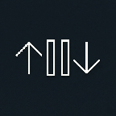

<div align="center">
  
  <h1>Voice Scroller 📱🎙️</h1>
  
  <p><b>Керуйте короткими відео (TikTok, Reels, Shorts) за допомогою голосу без дотиків до екрану!</b></p>

  <!-- Badges -->
  
  
  
  
</div>

---

## 🌟 Можливості
- **Повністю офлайн:** Жодне ваше слово не надсилається в інтернет. Усе розпізнавання відбувається локально на пристрої завдяки моделі [Vosk](https://alphacephei.com/vosk/).
- **Фонова робота:** Працює у фоновому режимі, дозволяючи вам гортати стрічку в інших додатках.
- **Емуляція свайпів:** Використовує Android Accessibility Service (Спеціальні можливості) для імітації реальних дотиків до екрану.
- **Оптимізовані команди:** Використовуються специфічні фрази, щоб уникнути конфліктів зі звуком із самих відео.

## 🗣️ Голосові команди (Англійською)
Додаток слухає вас і чекає на одну з цих команд:
* ⬇️ **Перегорнути вниз (наступне відео):** Скажіть `"next"` або `"scroll down"`
* ⬆️ **Перегорнути вгору (попереднє відео):** Скажіть `"back"` або `"scroll up"`
* ⏸️ **Пауза / Плей:** Скажіть `"pause"` або `"stop"`

---

## 📥 Встановлення (Детальна інструкція)

Для нових версій Android (13+) встановлення вимагає кількох додаткових кроків для безпеки, але це робиться лише один раз!

### Крок 1: Завантаження та Встановлення
1. Перейдіть у розділ **[Releases](https://github.com/cursiveerror/voice-scroller/releases)**.
2. Завантажте файл `VoiceScroller.apk` на свій телефон.
3. Відкрийте файл та натисніть **"Встановити"** (якщо телефон запитає дозвіл на встановлення з невідомих джерел — дозвольте).

> [!TIP]
> **Якщо звичайний встановлювач вашого телефону видає помилку "Додаток не встановлено" (часто буває на смартфонах OnePlus, Xiaomi та ін.):**
> Використовуйте альтернативні менеджери додатків для встановлення APK, наприклад **[SAI (Split APKs Installer)](https://play.google.com/store/apps/details?id=com.aefyr.sai)** з Google Play або **App Manager**. Просто відкрийте SAI, виберіть `Install APKs` -> `Internal file picker` -> знайдіть ваш завантажений `VoiceScroller.apk` і встановіть через нього.

### Крок 2: Розблокування "Обмежених налаштувань" (Для Android 13+)
*Сучасний Android з міркувань безпеки блокує "Спеціальні можливості" для додатків, завантажених не з Google Play.*
1. Перейдіть у загальні **Налаштування** телефону ➔ **Додатки (Apps)**.
2. Знайдіть у списку **Voice Scroller**.
3. У верхньому правому куті екрана натисніть на **три крапки (⋮)**.
4. Виберіть пункт **Дозволити обмежені налаштування (Allow restricted settings)** і підтвердьте дію сканером відбитка пальця або паролем.

### Крок 3: Надання дозволів
1. Відкрийте додаток **Voice Scroller**.
2. Натисніть кнопку **Enable Accessibility Service** (Спеціальні можливості).
   * Ви потрапите в налаштування пристрою. Знайдіть "Voice Scroller" (зазвичай у розділі "Завантажені додатки").
   * Увімкніть перемикач.
3. Поверніться в додаток і натисніть кнопку **Grant Microphone Permission** (Надати доступ до мікрофона). Дозвольте використання мікрофона "Під час використання додатку".

### Крок 4: Запуск
Коли всі кнопки дозволів зникнуть, у вас з'явиться одна велика кнопка — **Start Listening**.
Натисніть її, і в шторці сповіщень з'явиться значок програми. Тепер ви можете відкривати TikTok і гортати відео голосом! 🎉

---

## 🛠️ Для розробників (Як зібрати з коду)
1. Клонуйте репозиторій:
   ```bash
   git clone https://github.com/cursiveerror/voice-scroller.git
   ```
2. Відкрийте проєкт у **Android Studio**.
3. Зачекайте, поки Gradle завантажить усі залежності (включаючи бібліотеку Vosk).
4. Натисніть `Build -> Build Bundle(s) / APK(s) -> Build APK(s)`.

## ⚙️ Використані технології
- **Kotlin** & **Jetpack Compose** (Сучасний інтерфейс).
- **Foreground Services** (Для стабільної роботи у фоні).
- **AccessibilityService API** (Для імітації свайпів).
- **Vosk Android API** (Офлайн-розпізнавання мови).

## 📄 Ліцензія
Цей проєкт розповсюджується за ліцензією [MIT](LICENSE). Ви можете вільно використовувати та модифікувати код.
